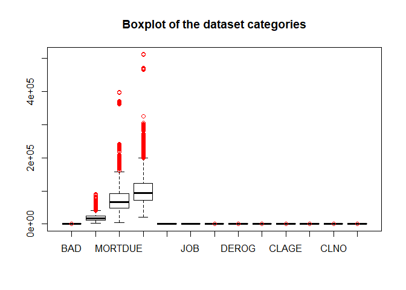

Loans\_analysis
================

\#Home Equity Loans Dataset

\#\#Introduction

The data set HMEQ reports characteristics and delinquency information
for 5,960 home equity loans. A home equity loan is a loan where the
borrower uses the equity of his or her home as the underlying
collateral. The data set has the following characteristics:

  - BAD: 1 = applicant defaulted on loan or seriously delinquent; 0 =
    applicant paid loan
  - LOAN: Amount of the loan request
  - MORTDUE: Amount due on existing mortgage
  - VALUE: Value of current property
  - REASON: DebtCon = debt consolidation; HomeImp = home improvement
  - JOB: Occupational categories
  - YOJ: Years at present job
  - DEROG: Number of major derogatory reports
  - DELINQ: Number of delinquent credit lines
  - CLAGE: Age of oldest credit line in months
  - NINQ: Number of recent credit inquiries
  - CLNO: Number of credit lines
  - DEBTINC: Debt-to-income ratio

source:<http://www.creditriskanalytics.net/datasets.html>

\#\#\#Basic Information About Loans **Credit Line:**  
This is a flexible loan that establishes the maximum loan amount the
customer can borrow. The borrower can access funds from the line of
credit at any time as long as they do not exceed the maximum amount set
in the agreement, and meet any other requirements such as making timely
minimum payments. The borrower pays interest only on the amount he
accessed from the credit line, and is not obligated to use the full
credit line.

**Derogatory Report:** This report typically indicates a serious
delinquency or late payments. It represent credit risk to lenders, and
would likely to have a substantial effect on customer ability to obtain
new credit. While some lenders still may be willing to extend credit to
someone with derogatory reports, they may do so with less than favorable
terms, such as higher interest rates or fees.

**Debt Consolidation:** Debt consolidation is the combination of several
unsecured debts payday loans, credit cards, medical bills into one
monthly bill. The lender is offering in exchange benefits such as a
lower interest rate, lower monthly payment and simplified debt relief
plan.

\#\#Our Goal In this project, we will investigate the relationship
between a customer personal information and their ability to meet the
requirements and return the loan. We will build a model that tries to
predict what is the probability that the loan will be returned, and at
what risk. This model will allow the lender to know the profitability of
giving the loan, and if any special interest is advised.

\#\#\#Preparing And Cleaning The Data\#\#\# In order to clean our
dataset, we’ve eliminated ‘NA’ values. This helped us to achieve a
better model as later shown. For columns that had string values, we
replaced the missing values with ‘Other’ for unknown data. We also used
boxplot graph to help us omit extreme values in certain categories - for
example for Mortdue there were 10 extreme values that were the extreme
outliers as we can see in red in the graph.

``` r
library(dplyr)
```

    ## 
    ## Attaching package: 'dplyr'

    ## The following objects are masked from 'package:stats':
    ## 
    ##     filter, lag

    ## The following objects are masked from 'package:base':
    ## 
    ##     intersect, setdiff, setequal, union

``` r
library(ggplot2)
library(factoextra)
```

    ## Welcome! Want to learn more? See two factoextra-related books at https://goo.gl/ve3WBa

``` r
data<-read.csv("hmeq.csv",stringsAsFactors = FALSE)
data<-na.omit(data)

#String columns:
for(i in 1:length(data$JOB)){
  if(data$JOB[i]==""){
    data$JOB[i]="Other"
  }
}
for(i in 1:length(data$REASON)){
  if(data$REASON[i]==""){
    data$REASON[i]="Other"
  }
}

#Using boxplot to omit extreme values:
data_for_boxplot <- data
data_for_boxplot$JOB<-as.factor(data$JOB)
data_for_boxplot$REASON<-as.factor(data$REASON)
boxplot(data_for_boxplot,main="Boxplot of the dataset categories",outcol="red")
```



``` r
data<-data[!data$MORTDUE>3e+05,]
data<-data[!data$VALUE>3e+05,]

#Final information 
dim(data)
```

    ## [1] 3502   13

``` r
summary(data)
```

    ##       BAD               LOAN          MORTDUE           VALUE       
    ##  Min.   :0.00000   Min.   : 1700   Min.   :  5076   Min.   : 21144  
    ##  1st Qu.:0.00000   1st Qu.:11900   1st Qu.: 48830   1st Qu.: 70850  
    ##  Median :0.00000   Median :16800   Median : 66463   Median : 93765  
    ##  Mean   :0.08709   Mean   :19108   Mean   : 74653   Mean   :105643  
    ##  3rd Qu.:0.00000   3rd Qu.:23575   3rd Qu.: 92072   3rd Qu.:121743  
    ##  Max.   :1.00000   Max.   :89900   Max.   :242111   Max.   :299772  
    ##     REASON              JOB                 YOJ            DEROG        
    ##  Length:3502        Length:3502        Min.   : 0.00   Min.   : 0.0000  
    ##  Class :character   Class :character   1st Qu.: 3.00   1st Qu.: 0.0000  
    ##  Mode  :character   Mode  :character   Median : 7.00   Median : 0.0000  
    ##                                        Mean   : 9.18   Mean   : 0.1471  
    ##                                        3rd Qu.:14.00   3rd Qu.: 0.0000  
    ##                                        Max.   :41.00   Max.   :10.0000  
    ##      DELINQ            CLAGE                NINQ             CLNO      
    ##  Min.   : 0.0000   Min.   :   0.4867   Min.   : 0.000   Min.   : 0.00  
    ##  1st Qu.: 0.0000   1st Qu.: 118.6381   1st Qu.: 0.000   1st Qu.:16.00  
    ##  Median : 0.0000   Median : 176.3756   Median : 0.000   Median :21.00  
    ##  Mean   : 0.2716   Mean   : 180.8435   Mean   : 1.018   Mean   :21.98  
    ##  3rd Qu.: 0.0000   3rd Qu.: 229.9286   3rd Qu.: 2.000   3rd Qu.:27.00  
    ##  Max.   :10.0000   Max.   :1168.2336   Max.   :13.000   Max.   :65.00  
    ##     DEBTINC        
    ##  Min.   :  0.8381  
    ##  1st Qu.: 29.3539  
    ##  Median : 34.9708  
    ##  Mean   : 34.0989  
    ##  3rd Qu.: 38.9840  
    ##  Max.   :144.1890

``` r
head(data)
```

    ##    BAD LOAN MORTDUE  VALUE  REASON    JOB YOJ DEROG DELINQ     CLAGE NINQ CLNO
    ## 6    1 1700   30548  40320 HomeImp  Other   9     0      0 101.46600    1    8
    ## 8    1 1800   28502  43034 HomeImp  Other  11     0      0  88.76603    0    8
    ## 20   0 2300  102370 120953 HomeImp Office   2     0      0  90.99253    0   13
    ## 26   1 2400   34863  47471 HomeImp    Mgr  12     0      0  70.49108    1   21
    ## 27   0 2400   98449 117195 HomeImp Office   4     0      0  93.81177    0   13
    ## 35   0 2900  103949 112505 HomeImp Office   1     0      0  96.10233    0   13
    ##     DEBTINC
    ## 6  37.11361
    ## 8  36.88489
    ## 20 31.58850
    ## 26 38.26360
    ## 27 29.68183
    ## 35 30.05114

\#\#\#Graphs And Analysis\#\#\# In this section we will analyze the
relationships between several categories and try to build the customer
profile. The following pie chart shows the percentage of customers who
returned their loans and customers who didn’t returned their loans. We
can see that the majority of customers have returned their loans.

``` r
a<-length(which(data$BAD==1))
b<-length(which(data$BAD==0))
a<-round(a/length(data$BAD)*100,digit=2)
b<-round(b/length(data$BAD)*100,digit=2)
pie(c(a,b),labels = c("Didn't return - 8.71%","Returned - 91.29%"),main="Precentage of returned home loans")
```


**YOJ and MORTDUE Vs BAD**

  - Mortdue Vs BAD - for both groups we can see that the majority of
    people had a ‘low’ (85K-165K\[USD\]) amount left to pay on their
    mortgage. For the people who didn’t return their loan we can see
    that the percentage of ‘very low’ is slightly higher. As for the
    other amounts there isn’t much difference between the ‘return’ and
    ‘didn’t return’ groups.

  - Yoj Vs BAD - here we can see similar inclination. We can notice that
    for people who didn’t return their loan there is a slightly higher
    percentage on ‘very low’ seniority (until 8.2 years).

<!-- end list -->

``` r
##mortdue VS bad
mortdue_fac<-cut(data$MORTDUE,breaks = 5)
names<-c("very low","low","medium","high","very high")
levels(mortdue_fac)<-names
mortdue_plot <- ggplot(data, aes(mortdue_fac, group =data$BAD)) + 
          geom_bar(aes(y = ..prop.., fill = factor(labels = c( "very low ~ 4.5K-85K","low ~ 85K-165K","medium ~ 165K-245K","high ~ 245K-320K","very high ~ >320K"),..x..)), stat="count") + 
          scale_y_continuous(labels=scales::percent) +
          ylab("percent") +guides(fill=guide_legend(title="mortde amount"))+
          facet_grid(~cut(data$BAD,breaks = 2,labels = c("return","didnt return")))+xlab("mortage amount")+ggtitle("Mortage amount Vs Bad")

mortdue_plot
```


``` r
##yoj vs bad

yoj_fac<-cut(data$YOJ,breaks = 5)
names<-c("very low","low","medium","high","very high")
levels(yoj_fac)<-names
yoj_plot <- ggplot(data, aes(yoj_fac, group =data$BAD)) + 
          geom_bar(aes(y = ..prop.., fill = factor(labels = c( "very low: 0-8.2 Years","low: 8.2-16.4 Years","medium: 16.4-24.6 Years","high: 24.6-32.8 Years","very high: >32.8 Years"),..x..)), stat="count") + 
          scale_y_continuous(labels=scales::percent) +
          ylab("percent") +guides(fill=guide_legend(title="yoj_plot"))+
          facet_grid(~cut(data$BAD,breaks = 2,labels = c("return","didnt return")))+ggtitle("Years at current job Vs Bad")

yoj_plot
```


**REASON and LOAN Vs BAD**

  - Reason Vs BAD -We can see that in both the returned and not returned
    groups over 50% of the borrower took the loan for DebtCon, this
    means that more people take a hmeq loan because they have debt that
    they need to pay back rather then just having their home renovated.

  - Loan Vs BAD - We can see similar results in both groups, most of the
    loans are what we called very low amount meaning in the range of
    1K$-20K$

<!-- end list -->

``` r
#tools
bad_breaks<-cut(data$BAD,breaks = 2)
bad_levels<-c("return","didn't return")
levels(bad_breaks)<-bad_levels
returned<-filter(data,data$BAD=="0")
notreturned<-filter(data,data$BAD=="1")

#reason vs bad
reason_plot <- ggplot(data, aes(data$REASON, group =data$BAD)) +  geom_bar(aes(y = ..prop.., fill = factor(labels=c("DebtCon","Homelmp","Other"),..x..)), stat="count") +  scale_y_continuous(labels=scales::percent) + ylab("percent") +guides(fill=guide_legend(title="Reason"))+facet_grid(~cut(data$BAD,breaks = 2,labels = c("return","didnt return")))
reason_plot+xlab("reason")+ggtitle("Reason Vs Bad")
```


``` r
#loan vs bad
amount<-cut(data$LOAN,breaks = 5)
names<-c("very low","low","medium","high","very high")
levels(amount)<-names
loan_plot <- ggplot(data, aes(amount, group =data$BAD)) + 
          geom_bar(aes(y = ..prop.., fill = factor(labels = c( "very low","low","medium","high","very high"),..x..)), stat="count") + 
          scale_y_continuous(labels=scales::percent) +
          ylab("percent") +guides(fill=guide_legend(title="amount"))+
          facet_grid(~cut(data$BAD,breaks = 2,labels = c("return","didnt return")))+xlab("loan amount")+ggtitle("Loan amount Vs Bad")

loan_plot
```


**MORTDUE Vs LOAN**

``` r
#Mortdue vs loan - out of the the people who didnt return
mVSl<-ggplot(notreturned,aes(x=notreturned$MORTDUE/(10^3),y=notreturned$LOAN))
mVSl+geom_point()+labs(title = "Amount due on existing mortgage VS Loan Taken",x="Mortdue [K$]",y="Loan [$]")
```


In this graph we can notice a few different relationships:

  - Most of the people who took 100K$ mortgage or less, took a loan that
    is about a quarter from that amount.
  - A high mortgage didn’t result in a high loan.

**Density plot for CLNO**

``` r
#Density in the number of credit lines 
clno<-ggplot(data,aes(x=data$CLNO,color=bad_breaks))
clno+geom_density()+labs(title="Number of credit lines",color="status",x="Number of credit lines",y="Density")+scale_color_manual(values=c("#999999", "#E69F00"))
```


From this plot we can can conclude:

  - The density for higher values of number of credit lines (40 and
    over) is higher for borrowers who didn’t returned their loans, we
    assume that this is due to poor economic management.
  - The density for lower values of number of credit lines (10 and less)
    is also higher for borrowers who didn’t returned their loans, we
    believe that it is likely that a first time loan is harder to return
    due to high interest.

**Correlation plot**

``` r
#correlation plot
numericval<-subset(data, select = -c(JOB,REASON))
cdata<-cor(numericval)
corrplot::corrplot(cdata,method = "number")
```


From this correlation matrix we can see that there is a strong
correlation between the value and mortdue parameters, because of this
reason we have decided to test this relationship by building a linear
model.

\#\#\#\#Linear Reggression analysis on highly correlated variables -
VALUE Vs MORTDUE  
As shown in the correlation plot above we can see a 0.84 correlation
that shows the relationship between the value of the current property
and the amount due on an existing mortgage. In this section we will make
further analysis indicating on how fitting is the linear model for this
relationship. We made a jitter plot which shows a somewhat a linear
relationship of the data, then we calculate the
\(R^2 = \frac{SSReg}{SST}\) value, that describes the proportion of
variation in the value that can be explained by this simple linear
model. We will also calculate the sigma \(\sigma\).

``` r
library(sandwich)
library(lmtest)
```

    ## Loading required package: zoo

    ## 
    ## Attaching package: 'zoo'

    ## The following objects are masked from 'package:base':
    ## 
    ##     as.Date, as.Date.numeric

``` r
#Part 1- analysis for highly correlated values- Mortdue and value 0.84 
g1<-ggplot(numericval, aes(x=numericval$MORTDUE/(10^3),y=numericval$VALUE/(10^3)))
g1+geom_jitter()+stat_smooth(method = "lm",col="red")+labs(title ="Value Vs Mortdue",x="Mortude[K$]",y="Value[K$]")
```

    ## Warning: Use of `numericval$MORTDUE` is discouraged. Use `MORTDUE` instead.

    ## Warning: Use of `numericval$VALUE` is discouraged. Use `VALUE` instead.

    ## Warning: Use of `numericval$MORTDUE` is discouraged. Use `MORTDUE` instead.

    ## Warning: Use of `numericval$VALUE` is discouraged. Use `VALUE` instead.

    ## `geom_smooth()` using formula 'y ~ x'


``` r
numericval$VALUE=numericval$VALUE/(10^3)
numericval$MORTDUE=numericval$MORTDUE/(10^3)
LM<-lm(VALUE~MORTDUE,data=numericval)

#Part 2- plotting the residuals vs fitted,Q-Q plot
par(mfrow=c(1,2))
plot(fitted(LM),resid(LM),xlab ="Fitted", ylab = "Residuals",col = "grey", main = "Residuals vs Fitted")
abline(h = 0, col = "darkorange", lwd = 2)
qqnorm(resid(LM), main = "Q-Q Plot", col = "darkgrey")
qqline(resid(LM), col = "dodgerblue", lwd = 2)
```


``` r
LMtest<-lm(VALUE~MORTDUE,data=numericval[0:5000,])
shapiro.test(resid(LMtest))
```

    ## 
    ##  Shapiro-Wilk normality test
    ## 
    ## data:  resid(LMtest)
    ## W = 0.72917, p-value < 2.2e-16

``` r
bptest(LMtest)
```

    ## 
    ##  studentized Breusch-Pagan test
    ## 
    ## data:  LMtest
    ## BP = 217.49, df = 1, p-value < 2.2e-16

Since the plot of the Value vs Mortdue shows a linear relationship we
wanted to test if the assumption for linearity and constant variance are
met. We can see that the linearity assumption is not met because for
fitted value, the mean of the residuals is very close to zero. As for
the constant variance assumption the spread of the residuals for the
fitted values is different for different values of fitted, so we say the
constant variance assumption is not valid, this is also confirmed by the
Breusch-Pagan test.

The Q-Q plot shows the data points varying from the straight line
(representing the theoretical quantiles of a normal distribution), in
other words the data did not come from a normal distribution, the
results of the Shapiro-Wilk test supports the graph. In the Shapiro-Wilk
test we got a very small p-value meaning there is a small probability
that the data came from a normal distribution.

``` r
#Part 3- now lets calculate sevral important parameters of this linear reggresion:
summary(LM)$r.squared
```

    ## [1] 0.7014665

``` r
summary(LM)$sigma
```

    ## [1] 27.42392

``` r
#Part 4- T test for beta0 and beta 1
summary(LM)$coefficients[2,]
```

    ##    Estimate  Std. Error     t value    Pr(>|t|) 
    ##  1.00762690  0.01111114 90.68614592  0.00000000

``` r
summary(LM)$coefficients[1,]
```

    ##      Estimate    Std. Error       t value      Pr(>|t|) 
    ##  3.042046e+01  9.501577e-01  3.201623e+01 1.705825e-197

From this summary we can see that the estimated \(\hat{\beta_1}\) is
equal to \(1.007\) and the estimated \(\hat{\beta_0}\) is \(30.420\)
meaning that we can write our estimated line equation like so:
\(\hat{y}= 30.420 +1.007x\). From this equation we can conclude that for
an increase in amount due on existing mortdue of 1K\[USD\] the estimated
mean of the value of the current property increase by 1.0007K\[USD\],
and if there is no amount due on existing mortdue the estimated mean
value of the current property will be 30.420K\[USD\].

\#\#\#\#\#The t-test results: **For the first t-test** -
\(H_0:\beta_1=0\) and \(H_a:\beta_1\neq0\) when we test for \(\beta_1\)
that means that if the null hypothesis is true it means there is no
relationship between the value and the murtdue. But if the alternative
hypothesis is true it means there is a linear relationship. According to
the summary results we can see that the p-value is 0 meaning the null
hypothesis is rejected and we accept that there is a linear relationship
between value and mortdue.  
**For the second t-test** - \(H_0:\beta_0 =0\) and
\(H_a:\beta_0\neq 0\), this test tells us what is the estimated value
when there is no mortdue, gives us a little more information on this
linear relationship. The p-value is \(1.7058*10^{-197}\) approximately
0, meaning we reject the null hypothesis.

``` r
#Confidence
con_predict<-predict(LM,newdata = data.frame(MORTDUE=c(50,111,220,367)),interval = "confidence",level = 0.99)
#Prediction
pred_predict<-predict(LM,newdata = data.frame(MORTDUE=c(50,111,220,367)),interval = "prediction",level = 0.99)
print(con_predict)
```

    ##         fit       lwr       upr
    ## 1  80.80181  79.41443  82.18919
    ## 2 142.26705 140.68283 143.85127
    ## 3 252.09838 247.76826 256.42850
    ## 4 400.21954 391.76313 408.67595

``` r
print(pred_predict)
```

    ##         fit       lwr      upr
    ## 1  80.80181  10.11031 151.4933
    ## 2 142.26705  71.57142 212.9627
    ## 3 252.09838 181.28798 322.9088
    ## 4 400.21954 329.03756 471.4015

``` r
#This is the width of the confidence intervals
Y<-con_predict[,3]-con_predict[,2]
plot(x=c(50,111,220,367),y=Y,xlab = "Mortdue[K$]",ylab = "Interval width",main = "Interval width vs Mortdue (confidence)")
```


In this part we wanted to know if we can make good predictions based on
this linear model. We took for example a 50,111,220,367K\[USD\] mortdue
(we chose these values randomly just for this example). Using the
predict function we can see the CI for a 0.99 level of confidence for
every mortdue value. For example we are 99% confidence that for a
50K\[USD\] mortdue the average value will be between
\((79.414,82.189)K[USD]\).

  - For the prediction interval we are 99% confidence that the next
    observation will be from the intervals presented above. Also we see
    that the prediction interval is much wider than the confidence one
    and that might be the reason we can see much difference in the
    integral width.  
    In general the results that we were able to produce using this model
    seems logical - meaning we can assume that for most cases if a
    person has a lot of mortgage left to pay one way it can be explained
    is by how high the value of the property is. Higher values
    properties will require a person to take a bigger loan leading to a
    large mortgage.

  - The plot above represents the confidence interval width, we can see
    that for higher mortdue values the interval width is getting wider,
    we believe that this is because there isn’t enough data when dealing
    with high mortdue values and so to keep the same confidence level
    the interval width must become larger.

\#\#\#\#Multipale variable regression: In this part we will investigate
the relationship between 3 variables: CLNO(number of credit lines),
BAD(1-for loan not returned, 0 for returned) and DEROG(number of major
derogatory reports). We believe there is a connection between the three,
after some research online we’ve found that the number of credit lines a
person has is affected by whether or not they have returned the loan.
For example a person who has a lot of credit lines is at higher risk of
not returning a loan. It is also affected by the number of derogatory
reports, these reports are negative, long-lasting indication that a
person didn’t pay back the loan as agreed.

``` r
library(dplyr)
library(ggplot2)
#Part 1- starting by plotting the data:
plot(CLNO ~ DEROG, data = numericval, col = BAD + 1,xlab="DEROG",ylab = "CLNO",main="CLNO vs DEROG (including BAD)")
legend("topright", c("BAD=0", "BAD=1"), fill = c(1, 2))
```


``` r
#Part 2- creating a violin plot for bad==1 and 0, for bad==0 we used 6 breaks to cut the DEROG sections to get a more accurate results.
ggplot(filter(numericval,numericval$BAD==1),aes(cut(DEROG,6),CLNO))+geom_violin()+labs(title = "Violin plot for people who didn't return their loan",x="DEROG",y="CLNO")
```


``` r
ggplot(filter(numericval,numericval$BAD==0),aes(cut(DEROG,6),CLNO))+geom_violin()+labs(title = "Violin plot for people who did return their loan",x="DEROG",y="CLNO")
```


From a first look on the CLNO vs DEROG graph we can see that our
expectations were met - meaning we can see that most of the people who
did returned their loan (BAD=0) had a low amount of derogatory reports.
On top of that we can see that the red dots are more common in higher
values of CLNO as opposed to the black dots (this will be demonstrated
in the violin plots). We can also see that there is not a single black
dot above 3 derogatory reports - meaning all of the people who returned
their loans have fewer then 3 derogatory reports.

**Looking at the violin plots in Part 2 we can point out a few
observations:**

  - **For people who didn’t returned their loan:** the kernel density
    plot shows that there is higher probability that the number of
    credit lines they own are roughly about 10-40 for most of the
    rangers for derogatory reports. This is an interesting results
    because it is common to think that a person who owns an extremely
    high amount of credit lines will probably declare bankruptcy or
    won’t return their loan, but this plot shows lower probability
    (for people who didn’t returned their loan) when it comes to number
    of credit lines that exceeds 50.

  - **For people who did return their loans:** from this plot we can see
    that for most people who did return their loan the number of credit
    lines is goes up until around 30. This teaches us on the behavior of
    a person who is expected to return a loan.

We decided to build a linear model using two different slopes and two
intercept breaking the model into sub-model, meaning out equation will
take the following form:
\(\hat{CLNO}=\beta_0+\beta_1DEROG +\beta_2BAD+\beta_3BAD*DEROG+\epsilon\).

``` r
#Part 1- creating the models:
LM2<-lm(CLNO~DEROG * BAD,data=numericval)
print(coef(LM2))
```

    ## (Intercept)       DEROG         BAD   DEROG:BAD 
    ##  21.8878206   0.4301177  -0.4780936   1.2110787

``` r
#Calculating the line for BAD=0
inter0=coef(LM2)[1]
slope0=coef(LM2)[2]
#Calculating the line for BAD=1
inter1=coef(LM2)[1]+coef(LM2)[3]
slope1=coef(LM2)[2]+coef(LM2)[4]

plot(CLNO~DEROG, data = numericval, col = BAD + 1,xlab="DEROG",ylab = "CLNO",main="CLNO vs DEROG (including BAD)")
legend("topright", c("BAD=0", "BAD=1"), fill = c(1, 2))
abline(inter0,slope0,col=1,lwd=2)
abline(inter1,slope1,col=2,lwd=2)
```


``` r
#Part 2- plotting the residuals vs fitted
par(mfrow=c(1,2))
plot(fitted(LM2),resid(LM2),xlab ="Fitted", ylab = "Residuals",col = "grey", main = "Residuals vs Fitted")
abline(h = 0, col = "darkorange", lwd = 2)
qqnorm(resid(LM2), main = "Normal Q-Q Plot", col = "darkgrey")
qqline(resid(LM2), col = "dodgerblue", lwd = 2)
```


``` r
#Part 3- using the Shapiro-Wilk Test to verify our results
LM2test<-lm(CLNO~DEROG * BAD,data=numericval[0:5000,])
shapiro.test(resid(LM2test))
```

    ## 
    ##  Shapiro-Wilk normality test
    ## 
    ## data:  resid(LM2test)
    ## W = 0.96593, p-value < 2.2e-16

``` r
bptest(LM2test)
```

    ## 
    ##  studentized Breusch-Pagan test
    ## 
    ## data:  LM2test
    ## BP = 85.979, df = 3, p-value < 2.2e-16

The plot of CLNO vs DEROG indicates a very small slope for both BAD=1
and BAD=0, making the linear lines less accurate in predicting values
for future data. Because of those results we added a plot representing
the residuals vs the fitted, this plot shows us that the variance isn’t
constant for the residuals in this model therefor violating the constant
variance assumption (supported by the Breusch-Pagan test). Also we can
note that there are many fitted value that the mean of the residuals is
not 0 meaning that our linear assumption is invalid.

The Q-Q plot shows the data points varying from the straight line, in
other words the data did not come from a normal distribution. The
results of the Shapiro-Wilk test supports the graph, we got a very small
p-value meaning there is a small probability that the data came from a
normal distribution.

\#\#Building A Model\#\# In this part we wanted to test different models
to predict our variable ‘BAD’. We decided to split our data to train and
test groups - the train is 30% and the test is 60%.

**Linear Model**

``` r
library(dplyr)
data<-na.omit(data)
data$JOB<-as.factor(data$JOB)
data$REASON<-as.factor(data$REASON)
data.train<-data %>%slice(1:1000)
data.test<-data %>%slice(1001:length(data$BAD))

#Linear model:
data.lm<-lm(BAD~.,data = data.train)
summary(data.lm)
```

    ## 
    ## Call:
    ## lm(formula = BAD ~ ., data = data.train)
    ## 
    ## Residuals:
    ##      Min       1Q   Median       3Q      Max 
    ## -0.48416 -0.14166 -0.06774  0.00656  1.00557 
    ## 
    ## Coefficients:
    ##                 Estimate Std. Error t value Pr(>|t|)    
    ## (Intercept)    1.012e-01  6.803e-02   1.488 0.137119    
    ## LOAN          -1.544e-05  4.180e-06  -3.694 0.000233 ***
    ## MORTDUE       -2.920e-06  8.009e-07  -3.646 0.000280 ***
    ## VALUE          1.267e-06  6.692e-07   1.894 0.058529 .  
    ## REASONHomeImp  2.405e-03  2.007e-02   0.120 0.904641    
    ## REASONOther    1.045e-01  6.537e-02   1.599 0.110151    
    ## JOBOffice     -6.470e-03  3.459e-02  -0.187 0.851659    
    ## JOBOther       6.133e-03  3.106e-02   0.197 0.843523    
    ## JOBProfExe     1.014e-02  3.577e-02   0.283 0.776888    
    ## JOBSales       6.111e-02  6.546e-02   0.934 0.350707    
    ## JOBSelf        1.402e-01  8.978e-02   1.562 0.118608    
    ## YOJ           -2.656e-03  1.319e-03  -2.013 0.044352 *  
    ## DEROG          8.744e-02  1.868e-02   4.680 3.27e-06 ***
    ## DELINQ         7.597e-02  1.020e-02   7.448 2.08e-13 ***
    ## CLAGE         -5.213e-04  1.353e-04  -3.853 0.000124 ***
    ## NINQ           5.401e-04  6.236e-03   0.087 0.930996    
    ## CLNO          -1.053e-03  1.055e-03  -0.999 0.318273    
    ## DEBTINC        9.479e-03  1.344e-03   7.052 3.33e-12 ***
    ## ---
    ## Signif. codes:  0 '***' 0.001 '**' 0.01 '*' 0.05 '.' 0.1 ' ' 1
    ## 
    ## Residual standard error: 0.2788 on 982 degrees of freedom
    ## Multiple R-squared:  0.1878, Adjusted R-squared:  0.1737 
    ## F-statistic: 13.36 on 17 and 982 DF,  p-value: < 2.2e-16

``` r
predict_lm<-predict(data.lm,data.train)
p_train_lm<-ifelse(predict_lm>0.5,1,0)
table(Prediction=as.numeric(p_train_lm),Reference=as.numeric(data.train$BAD))
```

    ##           Reference
    ## Prediction   0   1
    ##          0 895  91
    ##          1   0  14

``` r
accuracy<-mean(as.numeric(p_train_lm)==as.numeric(data.train$BAD))
print(accuracy)
```

    ## [1] 0.909

From a first glimpse of the results, it seems to be that this model
gives us a high accuracy of 90.9%. But we need to keep in mind that the
data is divided for the ‘BAD’ parameter - 91.2% for BAD=0 and 8.7% for
BAD=1 which means that in order to build a good model we need to take a
look at the confusion matrix. For example in the confusion matrix we can
see that we don’t have any FP but this doesn’t tells us much about how
good our prediction is, we can see that we have only 13.3% TN which
means that we can’t make a good on prediction on the thing that we are
most interested about - having a low error rate when predicting FN
meaning we predicted that the person will return the loan and they
didn’t. In fact in this case we would be better off random guessing\!

This model is predicting the variable ‘BAD’ which is a dummy variable
meaning the results that we will get are going to be between 0 and 1. In
the predict function we wanted to set the so called “Noise Margin” of
BAD, all the values that are over 0.5 are considered ‘1’ and below is
considered ‘0’.

**Logistic Model Using Dummy Variables**

``` r
#Inserting dummy variables in categorial variables:

for (i in 1:length(data$BAD))
{
  if (data$REASON[i]=="HomeImp")
  {data$isHoImp[i]<-1}
  else {data$isHoImp[i]<-0}
  if (data$REASON[i]=="DebtCon")
  {data$isDebtCon[i]<-1}
  else {data$isDebtCon[i]<-0}
  if (data$JOB[i]=="Self")
  {data$isSelf[i]<-1}
  else {data$isSelf[i]<-0}
   if (data$JOB[i]=="Mgr")
  {data$isMgr[i]<-1}
  else {data$isMgr[i]<-0}
    if (data$JOB[i]=="ProfExe")
  {data$isProfExe[i]<-1}
  else {data$isProfExe[i]<-0}
      if (data$JOB[i]=="Sales")
  {data$isSales[i]<-1}
  else {data$isSales[i]<-0}
  
  if (data$JOB[i]=="Other")
  {data$isOther[i]<-1}
  else {data$isOther[i]<-0}
  
}

#Removing categorial values

data<-data[c(-5:-6)]
names(data)
```

    ##  [1] "BAD"       "LOAN"      "MORTDUE"   "VALUE"     "YOJ"       "DEROG"    
    ##  [7] "DELINQ"    "CLAGE"     "NINQ"      "CLNO"      "DEBTINC"   "isHoImp"  
    ## [13] "isDebtCon" "isSelf"    "isMgr"     "isProfExe" "isSales"   "isOther"

``` r
#Same process as before:

data.train<-data %>%slice(1:1000)
data.test<-data %>%slice(1001:length(data$BAD))


data.dlog<-glm(BAD~.,data = data.train,family = binomial (link = "logit"))
summary(data.dlog)
```

    ## 
    ## Call:
    ## glm(formula = BAD ~ ., family = binomial(link = "logit"), data = data.train)
    ## 
    ## Deviance Residuals: 
    ##     Min       1Q   Median       3Q      Max  
    ## -1.2930  -0.4119  -0.2675  -0.1400   3.3876  
    ## 
    ## Coefficients:
    ##               Estimate Std. Error z value Pr(>|z|)    
    ## (Intercept) -6.641e-01  1.320e+00  -0.503 0.614909    
    ## LOAN        -1.387e-04  5.444e-05  -2.548 0.010822 *  
    ## MORTDUE     -5.208e-05  1.388e-05  -3.754 0.000174 ***
    ## VALUE        1.674e-05  1.122e-05   1.492 0.135624    
    ## YOJ         -4.630e-02  2.148e-02  -2.155 0.031133 *  
    ## DEROG        7.084e-01  2.011e-01   3.522 0.000428 ***
    ## DELINQ       7.871e-01  1.252e-01   6.286 3.26e-10 ***
    ## CLAGE       -9.578e-03  2.220e-03  -4.313 1.61e-05 ***
    ## NINQ        -8.944e-02  7.093e-02  -1.261 0.207317    
    ## CLNO        -3.518e-02  1.735e-02  -2.028 0.042560 *  
    ## DEBTINC      1.222e-01  2.029e-02   6.024 1.70e-09 ***
    ## isHoImp     -1.210e+00  8.917e-01  -1.357 0.174801    
    ## isDebtCon   -9.854e-01  8.963e-01  -1.099 0.271585    
    ## isSelf       2.612e+00  1.013e+00   2.579 0.009922 ** 
    ## isMgr        4.422e-01  4.958e-01   0.892 0.372526    
    ## isProfExe    4.938e-01  4.838e-01   1.021 0.307419    
    ## isSales      1.082e+00  6.997e-01   1.547 0.121831    
    ## isOther      2.904e-01  3.735e-01   0.777 0.436908    
    ## ---
    ## Signif. codes:  0 '***' 0.001 '**' 0.01 '*' 0.05 '.' 0.1 ' ' 1
    ## 
    ## (Dispersion parameter for binomial family taken to be 1)
    ## 
    ##     Null deviance: 671.86  on 999  degrees of freedom
    ## Residual deviance: 480.81  on 982  degrees of freedom
    ## AIC: 516.81
    ## 
    ## Number of Fisher Scoring iterations: 6

``` r
#Check prediction on trained data:

predict3<-predict(data.dlog,data.train)
p_train<-ifelse(predict3>0.5,1,0)
table(Predictions=as.numeric(p_train),Reference=as.numeric(data.train$BAD))
```

    ##            Reference
    ## Predictions   0   1
    ##           0 895  83
    ##           1   0  22

``` r
accuracy<-mean(as.numeric(p_train)==as.numeric(data.train$BAD))
print(accuracy)
```

    ## [1] 0.917

In this model we first created dummy variables for ‘JOB’ and ‘REASON’,
this was used to allow easy interpretation and calculation of the odds
ratios, and increases the stability and significance of the
coefficients.

We can see that using the logistic model gave us better accuracy, which
makes sense because logistic regression is a better predictor for
categorical variables - in our case the ‘BAD’ variable, we consider a
difference of 1% in the accuracy significance because of the way our
data is divided every percent means that we can predict even better the
number of people who will probably won’t return their loan. In addition
we can see that the FP group is still zero which is good, but even more
important is that the TN rate has rise to 21%. This is still not ideal
but it is almost double comparing to the linear model and that mean we
are twice less likely to give a person a loan and that they wouldn’t
return it.

**Logistic Model**  
As we mentioned before we wanted to reduce the number of variables in
our model without damaging the accuracy of the model. So we decided to
omit the ‘VALUE’ variable from our dataset since it was highly
correlated with ‘MORTDUE’.

``` r
data_no_val<-data[-4]
data.train<-data_no_val %>%slice(1:1000)
data.test<-data_no_val %>%slice(1001:length(data_no_val$BAD))
data.log<-glm(BAD~.,data = data.train,family = binomial(link="logit"))
summary(data.log)
```

    ## 
    ## Call:
    ## glm(formula = BAD ~ ., family = binomial(link = "logit"), data = data.train)
    ## 
    ## Deviance Residuals: 
    ##     Min       1Q   Median       3Q      Max  
    ## -1.3357  -0.4212  -0.2560  -0.1403   3.3446  
    ## 
    ## Coefficients:
    ##               Estimate Std. Error z value Pr(>|z|)    
    ## (Intercept) -4.362e-01  1.288e+00  -0.339 0.734873    
    ## LOAN        -1.218e-04  5.267e-05  -2.313 0.020708 *  
    ## MORTDUE     -3.456e-05  7.005e-06  -4.934 8.06e-07 ***
    ## YOJ         -4.699e-02  2.134e-02  -2.202 0.027680 *  
    ## DEROG        7.033e-01  1.972e-01   3.567 0.000362 ***
    ## DELINQ       7.908e-01  1.236e-01   6.400 1.56e-10 ***
    ## CLAGE       -8.641e-03  2.092e-03  -4.131 3.62e-05 ***
    ## NINQ        -8.916e-02  7.067e-02  -1.262 0.207060    
    ## CLNO        -3.768e-02  1.717e-02  -2.195 0.028184 *  
    ## DEBTINC      1.204e-01  2.007e-02   6.000 1.98e-09 ***
    ## isHoImp     -1.324e+00  8.777e-01  -1.509 0.131331    
    ## isDebtCon   -1.139e+00  8.786e-01  -1.297 0.194716    
    ## isSelf       2.510e+00  1.007e+00   2.493 0.012678 *  
    ## isMgr        4.247e-01  4.894e-01   0.868 0.385448    
    ## isProfExe    5.640e-01  4.798e-01   1.175 0.239797    
    ## isSales      9.274e-01  6.939e-01   1.336 0.181429    
    ## isOther      2.543e-01  3.715e-01   0.685 0.493574    
    ## ---
    ## Signif. codes:  0 '***' 0.001 '**' 0.01 '*' 0.05 '.' 0.1 ' ' 1
    ## 
    ## (Dispersion parameter for binomial family taken to be 1)
    ## 
    ##     Null deviance: 671.86  on 999  degrees of freedom
    ## Residual deviance: 482.93  on 983  degrees of freedom
    ## AIC: 516.93
    ## 
    ## Number of Fisher Scoring iterations: 6

``` r
pca_train<-prcomp(data.train,scale. = TRUE)
fviz_eig(pca_train)
```

<!-- --> Here we
added a graph that show the relationship between the number of
dimensions and the size of the variance. In other words as we reduce
models to smaller dimensions we receive a bigger variance since we are
trying to obtain the same amount of information in fewer variables.

``` r
predict_log<-predict(data.log,data.train)
p_train_log<-ifelse(predict_log>0.5,1,0)
table(Prediction=as.numeric(p_train_log),Reference=as.numeric(data.train$BAD))
```

    ##           Reference
    ## Prediction   0   1
    ##          0 895  84
    ##          1   0  21

``` r
accuracy<-mean(as.numeric(p_train_log)==as.numeric(data.train$BAD))
print(accuracy)
```

    ## [1] 0.916

This supports the correlation we’ve seen before, meaning we can
eliminate a variable and this reduces the degrees of freedom without
reducing the accuracy of the model.

**Applying the logistic model on the tested group**

``` r
library(caret)
```

    ## Loading required package: lattice

``` r
predict_log_test<-predict(data.log,data.test)
p_test<-ifelse(predict_log_test>0.5,1,0)
table(as.numeric(p_test),as.numeric(data.test$BAD))
```

    ##    
    ##        0    1
    ##   0 2299  172
    ##   1    3   28

``` r
confusionMatrix(as.factor(p_test),as.factor((data.test$BAD)))
```

    ## Confusion Matrix and Statistics
    ## 
    ##           Reference
    ## Prediction    0    1
    ##          0 2299  172
    ##          1    3   28
    ##                                           
    ##                Accuracy : 0.9301          
    ##                  95% CI : (0.9193, 0.9397)
    ##     No Information Rate : 0.9201          
    ##     P-Value [Acc > NIR] : 0.03354         
    ##                                           
    ##                   Kappa : 0.2258          
    ##                                           
    ##  Mcnemar's Test P-Value : < 2e-16         
    ##                                           
    ##             Sensitivity : 0.9987          
    ##             Specificity : 0.1400          
    ##          Pos Pred Value : 0.9304          
    ##          Neg Pred Value : 0.9032          
    ##              Prevalence : 0.9201          
    ##          Detection Rate : 0.9189          
    ##    Detection Prevalence : 0.9876          
    ##       Balanced Accuracy : 0.5693          
    ##                                           
    ##        'Positive' Class : 0               
    ## 

This shows a trade off between accuracy and TN rate. While the accuracy
has improved, the TN rate has slightly dropped. We need to keep in mind
that although the accuracy is 93% so is the NIR rate, meaning we would
be better off random guessing than using the model (the p-value shown
above supports this conclusion)

**Shuffle the data**  
We shuffled the data and tried the model again in order to double check
it:

``` r
split2 <- createDataPartition(data$BAD, p = 0.3, list = FALSE)
data.test2<-data[-split2,]
predict_log_test2<-predict(data.log,data.test2)
p_test2<-ifelse(predict_log_test2>0.5,1,0)
table(as.numeric(p_test2),as.numeric(data.test2$BAD))
```

    ##    
    ##        0    1
    ##   0 2234  185
    ##   1    2   30

``` r
confusionMatrix(as.factor(p_test2),as.factor((data.test2$BAD)))
```

    ## Confusion Matrix and Statistics
    ## 
    ##           Reference
    ## Prediction    0    1
    ##          0 2234  185
    ##          1    2   30
    ##                                           
    ##                Accuracy : 0.9237          
    ##                  95% CI : (0.9125, 0.9339)
    ##     No Information Rate : 0.9123          
    ##     P-Value [Acc > NIR] : 0.0231          
    ##                                           
    ##                   Kappa : 0.2253          
    ##                                           
    ##  Mcnemar's Test P-Value : <2e-16          
    ##                                           
    ##             Sensitivity : 0.9991          
    ##             Specificity : 0.1395          
    ##          Pos Pred Value : 0.9235          
    ##          Neg Pred Value : 0.9375          
    ##              Prevalence : 0.9123          
    ##          Detection Rate : 0.9115          
    ##    Detection Prevalence : 0.9869          
    ##       Balanced Accuracy : 0.5693          
    ##                                           
    ##        'Positive' Class : 0               
    ## 

We can see that also after shuffling the data we get the same results,
So this model is not randomly.

**Random Forest**  
In this part we will implement the random forest method on our data.
Random forest is a method based on the idea of classification (meaning
knowing what class does an observation belongs to), it consists of a
large number of individual decision trees. Each individual tree in the
random forest spits out a class prediction and the class with the most
votes becomes our model?s prediction.

``` r
#Random forest

data<-data[-4]
data.train<-data %>%slice(1:1000)
data.test<-data %>%slice(1001:length(data$BAD))

library(randomForest)
```

    ## randomForest 4.6-14

    ## Type rfNews() to see new features/changes/bug fixes.

    ## 
    ## Attaching package: 'randomForest'

    ## The following object is masked from 'package:ggplot2':
    ## 
    ##     margin

    ## The following object is masked from 'package:dplyr':
    ## 
    ##     combine

``` r
data_forrest<-randomForest(BAD~.,data = data.train,mtry=17)
```

    ## Warning in randomForest.default(m, y, ...): The response has five or fewer
    ## unique values. Are you sure you want to do regression?

    ## Warning in randomForest.default(m, y, ...): invalid mtry: reset to within valid
    ## range

``` r
#Check prediction on trained data:

predict7<-predict(data_forrest,data.train)
p_train<-ifelse(predict7>0.5,1,0)
table(as.numeric(p_train),as.numeric(data.train$BAD))
```

    ##    
    ##       0   1
    ##   0 895   3
    ##   1   0 102

``` r
accuracy<-mean(as.numeric(p_train)==as.numeric(data.train$BAD))
print(accuracy)
```

    ## [1] 0.997

We can see that when using random forest on the train data both the
accuracy and the TN rate are very high (which is good for the reasons
explained prior).

``` r
importance(data_forrest)
```

    ##           IncNodePurity
    ## LOAN          8.7731886
    ## MORTDUE      12.2825383
    ## YOJ           5.4160067
    ## DEROG         3.0362290
    ## DELINQ        8.0685032
    ## CLAGE        17.4396894
    ## NINQ          2.3394820
    ## CLNO          8.1992579
    ## DEBTINC      19.0279959
    ## isHoImp       0.9282481
    ## isDebtCon     0.7950391
    ## isSelf        0.1756387
    ## isMgr         0.7067480
    ## isProfExe     0.5479912
    ## isSales       1.5092164
    ## isOther       0.7694655

We can see from the importance data that DEBTINC,CLAGE,MORTDUE are the
most dominate parameters in our prediction. This makes sense for all
three parameters:

  - DEBTINC - the ratio between your debt and income tells a lot about
    whether or not you would be able to pay off the loan, the higher the
    rate the higher you are at risk of not returning your loan.

  - CLAGE - this parameter tells the oldest credit line in months, the
    older the credit line tells the borrower that loaner may drag the
    payments and not pay back on time.

  - MORTDUE - is the amount due on an existing mortgage, there is a
    significant effect of how much mortgage you have to pay off and the
    probability of returning a loan. If there is a lot of mortgage left
    for a person to return he is less likely to be able to afford to
    return an extra new loan.

<!-- end list -->

``` r
plot(data_forrest)
```

<!-- -->

The error rate is becoming much smaller as we increase the number of
trees we use in the random forest test.

Like in the logistic model, we will test the model on test group, and
then we will shuffle the data and try it again

``` r
predict_forrest_test<-predict(data_forrest,data.test)
p_test<-ifelse(predict_forrest_test>0.5,1,0)
table(as.numeric(p_test),as.numeric(data.test$BAD))
```

    ##    
    ##        0    1
    ##   0 2180   99
    ##   1  122  101

``` r
accuracy<-mean(as.numeric(p_test)==as.numeric(data.test$BAD))
print(accuracy)
```

    ## [1] 0.9116707

``` r
#Now we will shuffle the data and run it again:
predict_forrest_test2<-predict(data_forrest,data.test2)
p_test2<-ifelse(predict_forrest_test2>0.5,1,0)
table(as.numeric(p_test2),as.numeric(data.test2$BAD))
```

    ##    
    ##        0    1
    ##   0 2150   72
    ##   1   86  143

``` r
confusionMatrix(as.factor(p_test2),as.factor((data.test2$BAD)))
```

    ## Confusion Matrix and Statistics
    ## 
    ##           Reference
    ## Prediction    0    1
    ##          0 2150   72
    ##          1   86  143
    ##                                           
    ##                Accuracy : 0.9355          
    ##                  95% CI : (0.9251, 0.9449)
    ##     No Information Rate : 0.9123          
    ##     P-Value [Acc > NIR] : 1.307e-05       
    ##                                           
    ##                   Kappa : 0.6087          
    ##                                           
    ##  Mcnemar's Test P-Value : 0.301           
    ##                                           
    ##             Sensitivity : 0.9615          
    ##             Specificity : 0.6651          
    ##          Pos Pred Value : 0.9676          
    ##          Neg Pred Value : 0.6245          
    ##              Prevalence : 0.9123          
    ##          Detection Rate : 0.8772          
    ##    Detection Prevalence : 0.9066          
    ##       Balanced Accuracy : 0.8133          
    ##                                           
    ##        'Positive' Class : 0               
    ## 

we see that accuracy on the shuffeld data is better then the logistic
regression.

\#\#\#Final conclutions  
After testing several different models when trying to predict whether a
person will return a loan or not, we can divide the decision in two
cases. The first is regarding small loans, in that case we don’t to miss
a potential client that is likely to return a loan. If we follow the
model most chances are that the person will return the loan and if we
were wrong, the loss will be small and no large damage will happen to
the loaner. In this case we will advise to use the logistics model
because it has a much higher rate in making a good predictions for
people who will return a loan.  
However for the second case, regarding large loans we will advice using
the random forest model. This model makes better predictions as opposed
to the logistics model when it comes predicting ‘BAD’=1 which means
people who won’t return a loan. When dealing with large loans it is
important for us to not miss when saying this person will return a loan.
